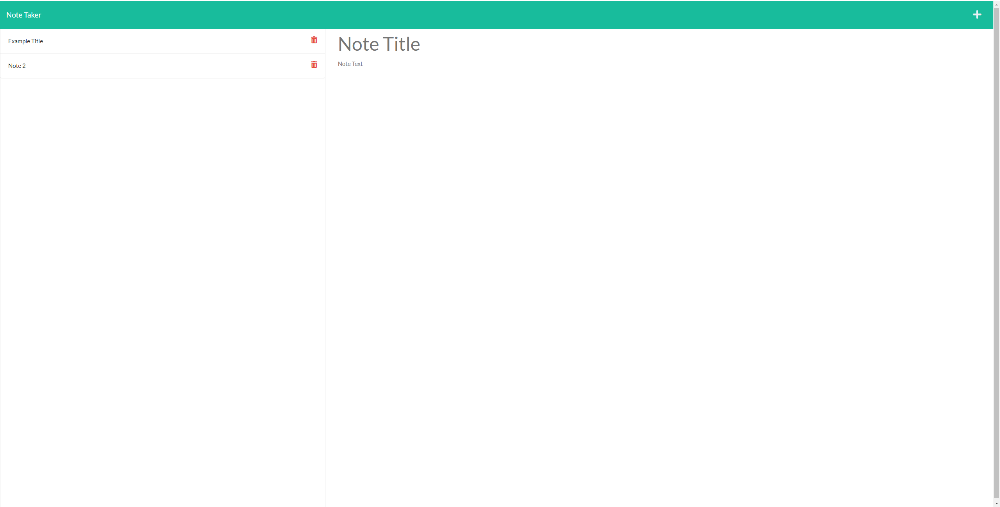

  # Note Taker    

  ## Description

  Note Taker is an application that uses html, javascript, express and node.js to display notes stored on the database, to add additional notes and to delete notes that are no longer needed. This project was also displays to uses of routes and interactions between the front and back end.

  ## Table of contents

  * [Installation](#Installation)
  * [Usage](#Usage)
  * [Tests](#Tests)
  * [Contributing](#Contributing)
  * [License](#License)
  * [Questions](#Questions)

  
  ## Installation 

  Clone the github repo and run "npm i".

  ## Usage 

  It can be used to write and keep track of various notes.

  Deployed application:  
  https://infinite-waters-03244.herokuapp.com/

  

  ## Contributing 

  Use at will!

  ## License 
  
    mit License
    https://spdx.org/licenses/MIT.html
    

  ## Questions 

  If you have any questions, please feel free to contact me at:        
  Github: [https://github.com/biscuit231](https://github.com/biscuit231)         
  Email address: jesse_11biscuit@hotmail.com        

